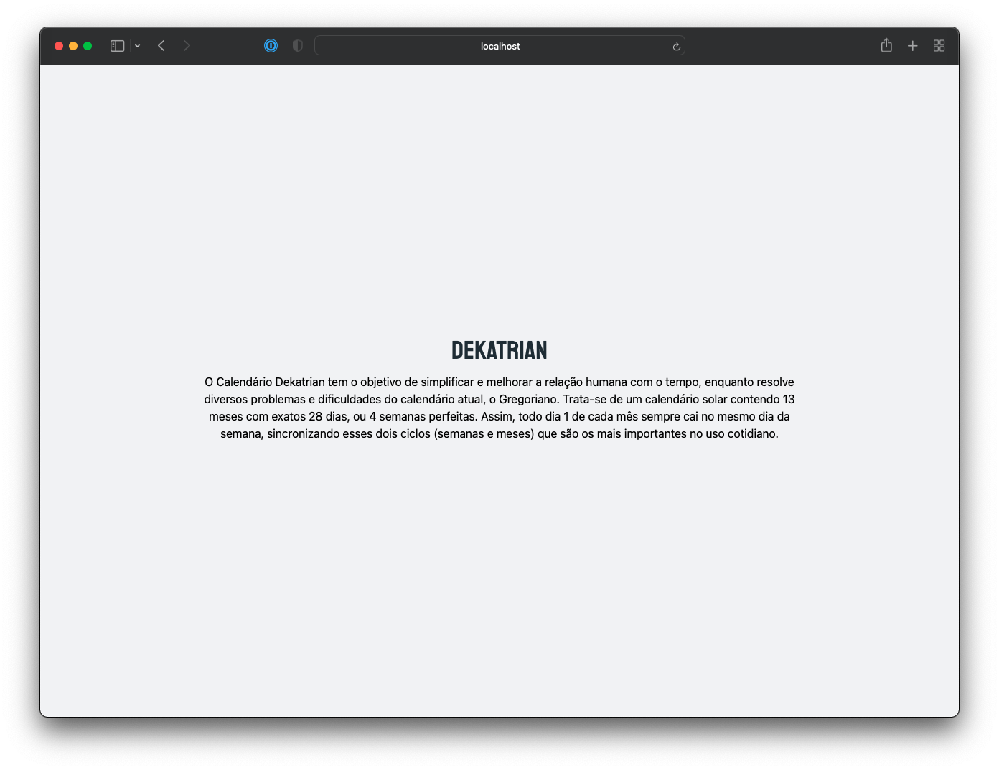

# dekatrian.com

[](https://www.typescriptlang.org/)
[](https://vuejs.org/)
[](https://nuxtjs.org/)



## TL;DR

### Development

```bash
# install dependencies
npm install

# serve with hot reload at localhost:3000
npm run dev
```

### Build

```bash
# build for production and launch server
npm run build
npm run start

# generate static project
npm run generate
```

## Contributing

1. Fork it!
2. Create your feature branch
   - `git checkout -b feature/my-new-feature`
3. Commit your changes
   - `git commit -m "feat: add some feature"`
4. Push to the branch
   - `git push origin feature/my-new-feature`
5. Submit a pull request

## Security Vulnerabilities

If you discover a security vulnerability within this project, please send an e-mail to Magno Biét via [magno.biet@gmail.com](mailto:magno.biet@gmail.com). All security vulnerabilities will be promptly addressed.

## License

This package is licensed under the [MIT license](https://magno.mit-license.org/2022). Copyright © Magno Biét
